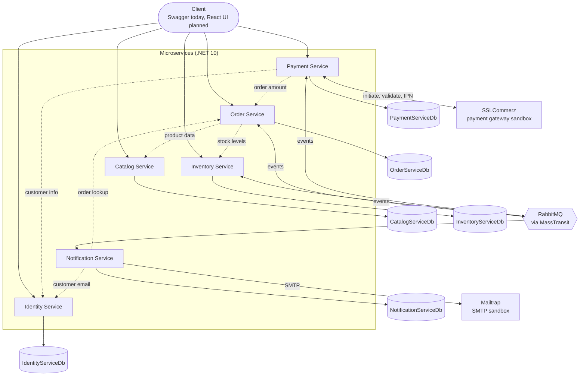
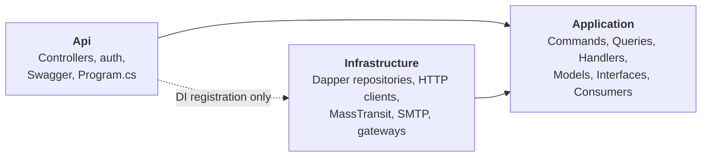
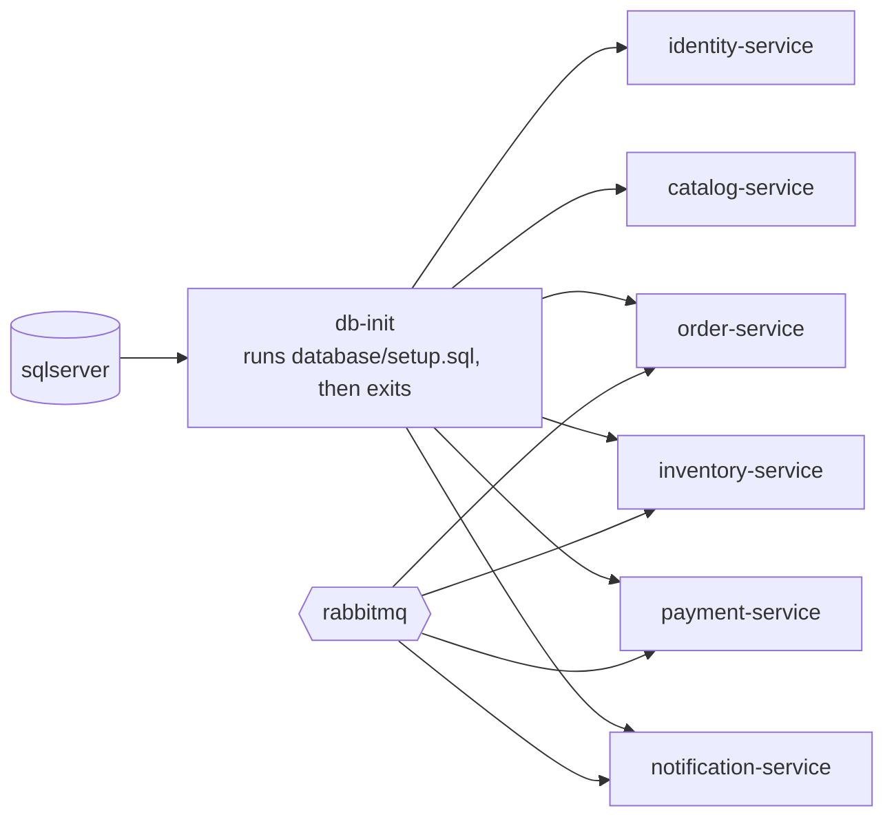
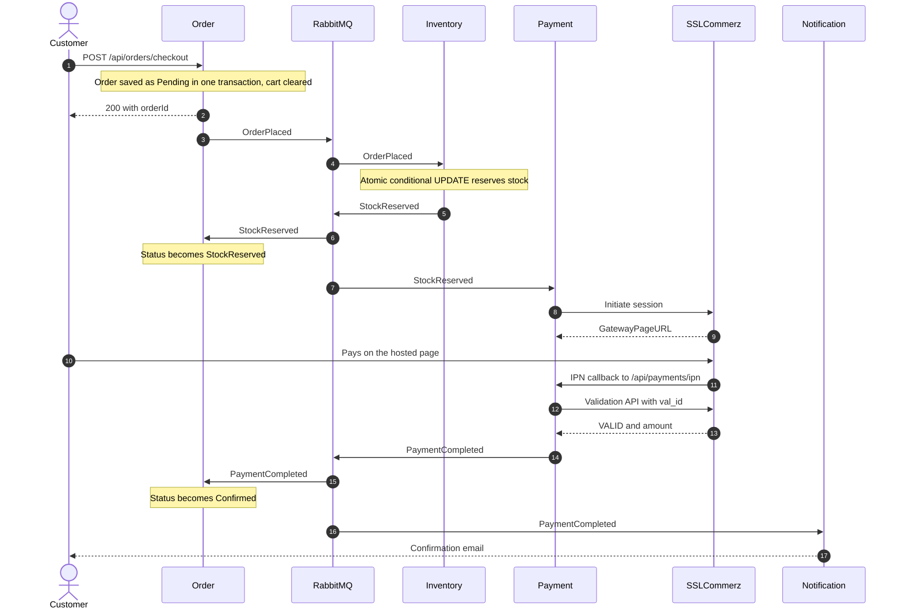
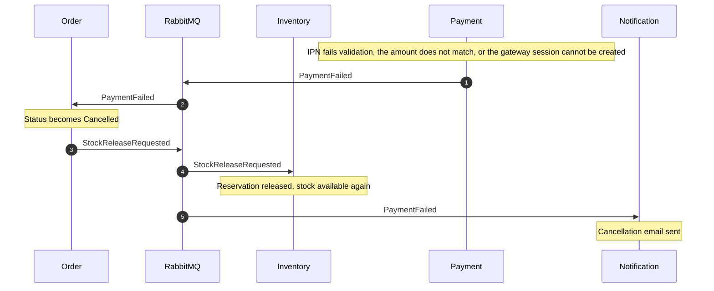
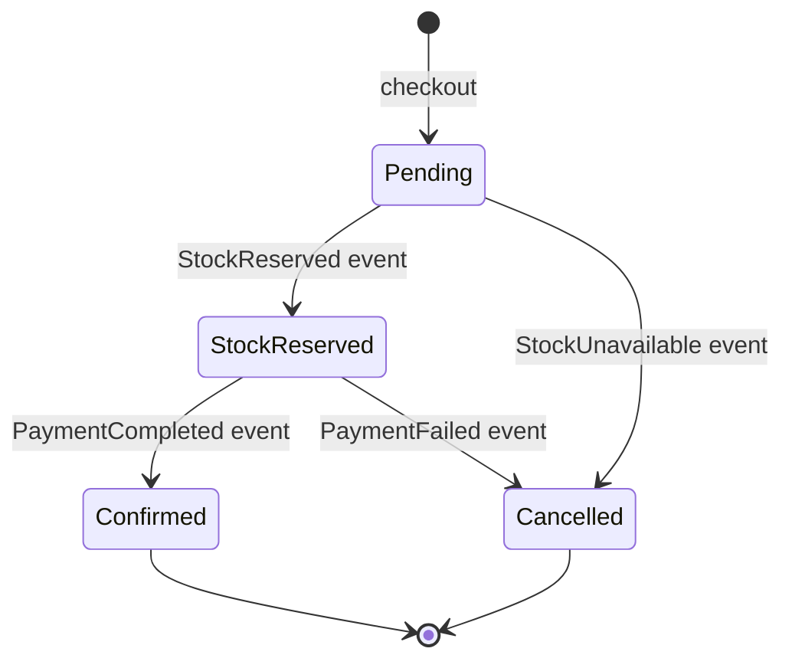
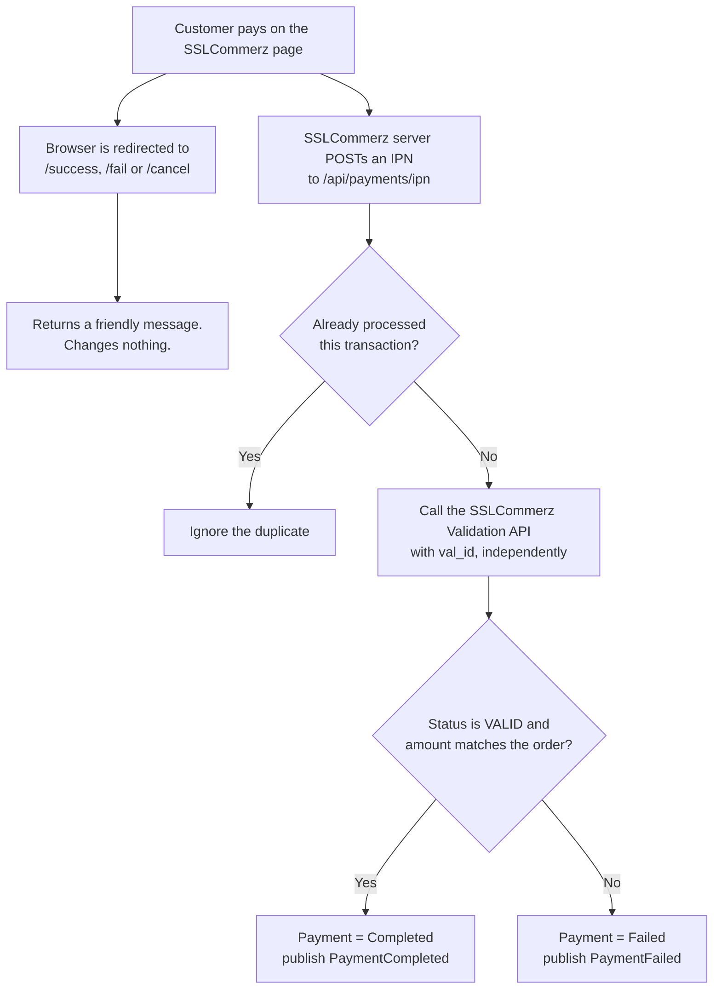

# E-Commerce Microservices Platform

> A production-style e-commerce backend built with **.NET 10**: six independently deployable services, an **event-driven Saga with compensating transactions**, a **real payment gateway integration** (SSLCommerz), and a **one-command Docker Compose environment**.


```powershell
git clone https://github.com/tusar-molla/ecommerce-microservices.git
cd ecommerce-microservices
Copy-Item .env.example .env      # then edit .env (see "Configuration")
docker compose up -d --build     # SQL Server, RabbitMQ and all six services
```

Then open the Swagger pages listed under [Getting started](#getting-started).

---

## Contents

- [Overview](#overview)
- [Architecture](#architecture)
- [The checkout Saga](#the-checkout-saga)
- [Payment security model](#payment-security-model)
- [Engineering highlights](#engineering-highlights)
- [Service reference](#service-reference)
- [Tech stack](#tech-stack)
- [Getting started](#getting-started)
- [Configuration](#configuration)
- [Try it: end-to-end walkthrough](#try-it-end-to-end-walkthrough)
- [Useful commands and troubleshooting](#useful-commands-and-troubleshooting)
- [Design decisions and trade-offs](#design-decisions-and-trade-offs)
- [Known limitations and roadmap](#known-limitations-and-roadmap)
- [Repository structure](#repository-structure)

---

## Overview

A customer browses a catalog, fills a cart, checks out, pays through a real payment gateway, and gets an email. Behind that flow, six services each own one business capability and one database, and coordinate through events instead of shared tables or chained synchronous calls.

| Service | Owns | Highlights |
|---|---|---|
| **Identity** | Users, roles, tokens | JWT access + refresh tokens with rotation, immediate revocation on logout, role-based authorization |
| **Catalog** | Products, categories, images | Soft delete, pagination and filtering, multi-image support, batched lookups for other services |
| **Order** | Cart, orders | Live-priced cart, transactional checkout with price snapshots, Saga participant, Hangfire cleanup job |
| **Inventory** | Stock, reservations | Atomic oversell-safe reservation, compensating stock release, admin stock tools |
| **Payment** | Payments | SSLCommerz sandbox (redirect + IPN), server-side validation, duplicate-callback protection |
| **Notification** | Notification log | Event-driven transactional email (SMTP), send-once guard, audit trail |

The full flow was verified end to end against the real SSLCommerz sandbox: the success path (paid, order confirmed, email sent) and the failure path (payment cancelled, order cancelled, stock released).

---

## Architecture

### System view



**How to read it:** solid arrows are client requests, data access, and asynchronous events. Dotted arrows are synchronous HTTP calls between services. Each service has its own database (one SQL Server instance, separate databases) and never reads another service's tables.

### Inside each service

Every service uses the same three-project layout, so once you've read one, you've read them all.



- **Application** depends on nothing. It defines interfaces such as `IPaymentGateway`, `IEmailSender`, `IStockRepository`, and `IFileStorageService`.
- **Infrastructure** implements those interfaces. Swapping SSLCommerz for Stripe, Mailtrap for SendGrid, or local disk for S3 means writing one new class and changing one line of DI, with no changes to business logic.
- **Api** is thin. Controllers only dispatch to MediatR (CQRS).
- There is deliberately no separate Domain project (see [trade-offs](#design-decisions-and-trade-offs)).

### What Docker Compose runs



Arrows show start-up order. Services that use messaging wait for RabbitMQ to be healthy. Every service waits for `db-init`, an idempotent job that creates all databases and tables and then exits. Inside the Compose network, services reach each other by name over plain HTTP (for example `http://catalog-service:8080`).

### Shared code

`ECommerce.Contracts` is the only code shared between services. It contains event shapes and nothing else, no logic. Services never reference each other's projects.

---

## The checkout Saga

Checkout touches four services but uses no distributed transaction. Each service does its own local work and announces the result as an event (a **choreographed Saga**). When something fails, services run compensating actions instead of rolling back.

### Success path



### Failure paths and compensation



| Failure | Detected by | Result |
|---|---|---|
| Not enough stock at reservation time | Inventory (conditional UPDATE affects 0 rows) | `StockUnavailable` → order cancelled, customer emailed. Any items already reserved for that order are rolled back inside Inventory. |
| Payment declined, cancelled, or invalid | Payment (gateway validation) | `PaymentFailed` → order cancelled, stock released, customer emailed |
| Gateway session cannot be created (bad credentials, outage) | Payment (initiate call fails) | `PaymentFailed`, same compensation as a declined payment |
| Amount in the callback differs from the order total | Payment (amount check) | Treated as a failed payment |
| Duplicate IPN from the gateway | Payment (`ProcessedIpnCallbacks`) | Ignored |
| Duplicate event delivery to Notification | Notification (send-once guard) | No second email |

### Order lifecycle



`Shipped` and `Delivered` exist in the status enum for a future fulfillment flow but are not driven by any event yet.

### Events

| Event | Published by | Consumed by |
|---|---|---|
| `OrderPlaced` | Order | Inventory |
| `StockReserved` | Inventory | Order, Payment |
| `StockUnavailable` | Inventory | Order, Notification |
| `PaymentCompleted` | Payment | Order, Notification |
| `PaymentFailed` | Payment | Order, Notification |
| `StockReleaseRequested` | Order | Inventory |

Each consumer has its own queue (for example `inventory-order-placed-queue`, `notification-payment-failed-queue`), so one event can fan out to several services independently.

---

## Payment security model

The payment flow rests on one rule: **nothing a customer's browser can reach is allowed to mark an order as paid.**



- The `/success`, `/fail`, and `/cancel` URLs are ordinary public endpoints. Anyone can visit them, so they only display a message.
- The IPN body is not trusted either. Payment Service takes the `val_id` from it and asks SSLCommerz directly whether the transaction is real and what amount was paid. Only that answer counts.
- A customer can forge a request to our server. They cannot forge SSLCommerz's answer to a server-to-server call.

---

## Engineering highlights

| Topic | What was done |
|---|---|
| **Overselling prevention** | Stock reservation is a single conditional `UPDATE ... WHERE QuantityAvailable >= @qty` (`TryReserveStockAsync`), so the check and the decrement can't be separated by a concurrent request. A multi-item order that partially succeeds rolls back its earlier reservations. |
| **Compensating transactions** | Payment failure triggers order cancellation and a `StockReleaseRequested` event that Inventory handles with the same release logic used for partial rollback. |
| **Gateway trust boundary** | Browser redirects are display-only. The IPN is cross-checked against SSLCommerz's Validation API, including amount, and deduplicated by transaction id. |
| **Immediate token revocation** | JWTs are stateless, so logout alone can't invalidate an access token. Logout stores the token's `jti` in a blocklist checked by middleware that runs between authentication and authorization, and rotates and revokes refresh tokens. The blocklist sits behind `ITokenBlocklistService` so a Redis implementation can replace SQL. |
| **IDOR protection** | `GetOrderById` and the payment queries compare the resource's `UserId` to the caller's JWT and return 404 on mismatch. The user id always comes from the token, never from the request body. |
| **Live vs snapshot data** | Cart lines store only `ProductId` and quantity and are priced live from Catalog. At checkout, name and price are copied into `OrderItems` so later catalog changes can't rewrite history. |
| **Fail-fast validation** | `AddToCart` checks live stock, including the quantity already in the cart, and rejects with a clear message before anything is written. The authoritative check still happens atomically in Inventory. |
| **Avoiding N+1** | Images for a page of products are loaded in one `IN (...)` query. Order Service uses Catalog's bulk endpoint instead of one call per cart line. |
| **Service-to-service auth** | Internal endpoints (`/internal/...`) are protected by an `X-Internal-Api-Key` filter, separate from customer JWTs. |
| **Transactions** | Order plus items are written in one DB transaction. The cart is cleared only after the order is safely stored, and events are published after the commit. |
| **Replaceable infrastructure** | Gateway, email, file storage, token blocklist, and messaging all sit behind interfaces defined in the Application layer. |
| **One-command environment** | Multi-stage Dockerfiles per service, a Compose file with health checks and start-up ordering, and an idempotent `db-init` job. All settings come from environment variables, with no secrets in git or in images. |
| **Background jobs** | Hangfire runs a daily job that deletes carts untouched for 30 days. |

---

## Service reference

<details>
<summary><b>Identity Service</b> (<code>:8081</code>, <code>IdentityServiceDb</code>)</summary>

| Method | Route | Access | Purpose |
|---|---|---|---|
| POST | `/api/auth/register` | Public | Register (always a Customer) |
| POST | `/api/auth/login` | Public | Returns access and refresh tokens |
| POST | `/api/auth/refresh` | Public | Exchange a refresh token (single-use, rotated) |
| POST | `/api/auth/logout` | Authenticated | Revokes the refresh token and blocklists the access token |
| GET | `/api/auth/me` | Authenticated | Current user |
| GET | `/api/auth/internal/{userId}` | Internal API key | User lookup for other services |

Roles: `Customer`, `Admin`. The first Admin is promoted manually in the database, deliberately, since there is no self-service path to elevated roles.

Tables: `Users`, `RefreshTokens`, `RevokedAccessTokens`.
</details>

<details>
<summary><b>Catalog Service</b> (<code>:8082</code>, <code>CatalogServiceDb</code>)</summary>

| Method | Route | Access | Purpose |
|---|---|---|---|
| GET | `/api/products` | Public | Paged list, optional `categoryId` filter |
| GET | `/api/products/{id}` | Public | Product with images |
| GET | `/api/products/bulk?ids=` | Public | Batched lookup (used by Order) |
| GET | `/api/products/ids` | Public | All active product ids (used by Inventory) |
| POST | `/api/products` | Admin | Create with multiple images (`multipart/form-data`) |
| PUT | `/api/products/{id}` | Admin | Update (SKU is immutable) |
| DELETE | `/api/products/{id}` | Admin | Soft delete |
| POST | `/api/products/{id}/image` | Admin | Add an image |
| PATCH | `/api/products/{id}/images/{imageId}/set-primary` | Admin | Choose the primary image |
| DELETE | `/api/products/{id}/images/{imageId}` | Admin | Remove an image |
| GET / POST | `/api/categories` | Public / Admin | List and create categories |

Images live in a generic `Files` table (`EntityType` + `EntityId`) so other entities can reuse it. Storage is local disk (a Docker volume) behind `IFileStorageService`, ready for an S3 implementation.

Tables: `Categories`, `Products`, `Files`.
</details>

<details>
<summary><b>Order Service</b> (<code>:8083</code>, <code>OrderServiceDb</code>)</summary>

| Method | Route | Access | Purpose |
|---|---|---|---|
| GET | `/api/cart` | Customer | Cart with live price, image, and stock availability message |
| POST | `/api/cart/items` | Customer | Add (idempotent: same product increments quantity) |
| DELETE | `/api/cart/items/{productId}` | Customer | Remove a line |
| DELETE | `/api/cart` | Customer | Clear the cart |
| POST | `/api/orders/checkout` | Customer | Convert the cart to an order and start the Saga |
| GET | `/api/orders/{orderId}` | Customer | Own order only |
| GET | `/api/orders/my-orders` | Customer | Order history |
| GET | `/api/orders/internal/{orderId}` | Internal API key | Order lookup for other services |
| | `/hangfire` | Dev only | Job dashboard |

Consumes: `StockReserved`, `StockUnavailable`, `PaymentCompleted`, `PaymentFailed`. Publishes: `OrderPlaced`, `StockReleaseRequested`.

Tables: `Carts`, `CartItems`, `Orders`, `OrderItems` (plus `HangfireDb` for job storage).
</details>

<details>
<summary><b>Inventory Service</b> (<code>:8084</code>, <code>InventoryServiceDb</code>)</summary>

| Method | Route | Access | Purpose |
|---|---|---|---|
| POST | `/api/stock` | Admin | Set initial stock for a product (rejected if it already exists) |
| POST | `/api/stock/adjust` | Admin | Add or remove stock (cannot go negative) |
| GET | `/api/stock/missing` | Admin | Products that exist in Catalog but have no stock record |
| GET | `/api/stock-levels?productIds=` | Public | Available quantities |

Consumes: `OrderPlaced`, `StockReleaseRequested`. Publishes: `StockReserved`, `StockUnavailable`.

Cataloging a product and stocking it are deliberately separate business actions, so there is no hidden coupling between the two services. `GET /api/stock/missing` is the reconciliation tool for products someone forgot to stock.

Tables: `Stock`, `StockReservations`.
</details>

<details>
<summary><b>Payment Service</b> (<code>:8085</code>, <code>PaymentServiceDb</code>)</summary>

| Method | Route | Access | Purpose |
|---|---|---|---|
| GET | `/api/payments/{orderId}/redirect-url` | Customer | Hosted checkout URL for the order |
| GET | `/api/payments/order/{orderId}` | Customer | Own payment status |
| GET | `/api/payments/my-payments` | Customer | Payment history |
| POST | `/api/payments/success`, `/fail`, `/cancel` | Gateway redirect | Display only, change nothing |
| POST | `/api/payments/ipn` | Gateway callback | Validated, authoritative payment result |

Consumes: `StockReserved`. Publishes: `PaymentCompleted`, `PaymentFailed`.

Tables: `Payments`, `ProcessedIpnCallbacks`.
</details>

<details>
<summary><b>Notification Service</b> (<code>:8086</code>, <code>NotificationServiceDb</code>)</summary>

No public API. It only reacts to events.

| Event | Email |
|---|---|
| `PaymentCompleted` | Order confirmed |
| `PaymentFailed` | Order cancelled, payment failed |
| `StockUnavailable` | Order cancelled, item unavailable |

A shared dispatcher resolves order, then user, then email address through the other services, skips the send if one was already recorded as sent for that order and type, and writes every attempt (`Sent` or `Failed` with the error) to `NotificationLogs`. A failed send is logged and not retried forever.

Tables: `NotificationLogs`.
</details>

---

## Tech stack

| Area | Choice |
|---|---|
| Runtime | .NET 10, ASP.NET Core Web API |
| Data access | Dapper (raw SQL), SQL Server, one database per service |
| Patterns | CQRS with MediatR, repository per aggregate, FluentValidation |
| Messaging | RabbitMQ through MassTransit |
| Auth | JWT bearer, BCrypt password hashing, refresh token rotation |
| Payments | SSLCommerz sandbox (hosted checkout and IPN) |
| Email | MailKit over SMTP, Mailtrap sandbox inbox |
| Background jobs | Hangfire (SQL Server storage) |
| API docs | Swagger / OpenAPI per service |
| Containers | Docker, Docker Compose (multi-stage builds) |
| Local tooling | ngrok (public URL for the payment IPN) |

---

## Getting started

### Prerequisites

- [Docker Desktop](https://www.docker.com/products/docker-desktop/) with at least **6 GB of memory** allocated (SQL Server alone needs 2 GB)
- Free sandbox accounts for [SSLCommerz](https://developer.sslcommerz.com/registration/) and [Mailtrap](https://mailtrap.io)
- [ngrok](https://ngrok.com), only if you want to complete a real sandbox payment

You do **not** need the .NET SDK or a local SQL Server to run the stack in Docker.

### 1. Clone and configure

```powershell
git clone https://github.com/tusar-molla/ecommerce-microservices.git
cd ecommerce-microservices
Copy-Item .env.example .env        # macOS/Linux: cp .env.example .env
```

Open `.env` and fill it in. See [Configuration](#configuration) for what each value does. `.env` is git-ignored.

### 2. Start everything

```powershell
docker compose up -d --build
docker compose ps -a
```

The first run takes a few minutes (it downloads the SQL Server, .NET, and RabbitMQ images). When it's done, `db-init` shows `Exited (0)`, which means the databases were created, and everything else shows `running`.

### 3. Open the services

| Service | Swagger |
|---|---|
| Identity | http://localhost:8081/swagger |
| Catalog | http://localhost:8082/swagger |
| Order | http://localhost:8083/swagger |
| Inventory | http://localhost:8084/swagger |
| Payment | http://localhost:8085/swagger |
| Notification | http://localhost:8086/swagger (no endpoints, it only consumes events) |
| RabbitMQ UI | http://localhost:15672 (user and password from `.env`, default guest / guest) |
| SQL Server | `localhost,14333`, login `sa`, password `SA_PASSWORD` from `.env` |

A token issued by Identity works on every service, because they all share the same `JWT_SECRET_KEY`. Use **Authorize** in each Swagger page.

### 4. Testing real payments (optional)

SSLCommerz's servers must be able to reach your machine to deliver the payment callback (IPN):

```powershell
ngrok http 8085
```

Put the forwarding URL in `.env` as `PAYMENT_PUBLIC_BASE_URL`, then recreate Payment Service:

```powershell
docker compose up -d payment-service
```

Without this, everything up to creating the payment session works, but completing the payment does not.

### Running from an IDE instead

Each Api project has an `appsettings.Development.example.json`. Copy it to `appsettings.Development.json` (git-ignored), fill it in, and run the services with `dotnet run --project <Service>/<Service>.Api --launch-profile https`. In this mode you need a local SQL Server (run [`database/setup.sql`](database/setup.sql) against it) and RabbitMQ (`docker compose up -d rabbitmq` works). Ports are in each project's `Properties/launchSettings.json`, and the `Services:*BaseUrl` values must match them. Don't run the same service in both modes at once, or two copies will compete for the same queue.

---

## Configuration

Nothing secret is committed. In Docker, configuration comes from `.env`, which Compose turns into environment variables (`Jwt__SecretKey` sets the setting `Jwt:SecretKey`). The committed `appsettings.json` files contain only logging settings.

| `.env` variable | Purpose |
|---|---|
| `SA_PASSWORD` | SQL Server `sa` password. 8+ characters with upper, lower, digit and symbol. Avoid `; = " ' $` and spaces. It only takes effect when the SQL volume is first created. |
| `JWT_SECRET_KEY` | Signing key shared by all services (32+ random characters) |
| `INTERNAL_API_KEY` | Shared key for the internal service-to-service endpoints |
| `RABBITMQ_USER`, `RABBITMQ_PASSWORD` | Broker credentials (default guest / guest) |
| `SSLCOMMERZ_STORE_ID`, `SSLCOMMERZ_STORE_PASSWORD` | Payment gateway sandbox credentials |
| `PAYMENT_PUBLIC_BASE_URL` | Public URL of Payment Service, used for the gateway callbacks (your ngrok URL) |
| `SMTP_USERNAME`, `SMTP_PASSWORD` | Mailtrap sandbox inbox credentials |

Compose refuses to start if `SA_PASSWORD`, `JWT_SECRET_KEY`, or `INTERNAL_API_KEY` is missing. If the SSLCommerz or SMTP values are empty, the stack still starts, but payments and emails fail.

Compose reads `.env` when it **creates** a container. After editing it, run `docker compose up -d` (not `restart`) so the affected services are recreated.

---

## Try it: end-to-end walkthrough

1. **Create an Admin.** Register through `POST /api/auth/register` on Identity, then promote the account with any SQL client connected to `localhost,14333`, and log in again so the token carries the role:
   ```sql
   UPDATE IdentityServiceDb.dbo.Users SET Role = 'Admin' WHERE Email = 'you@example.com';
   ```
2. **Seed the catalog.** As Admin on Catalog: create a category, then a product (`POST /api/products`, with an image if you like).
3. **Stock it.** On Inventory, `GET /api/stock/missing` shows the product has no stock record. Fix it with `POST /api/stock` and a quantity.
4. **Shop.** Register and log in as a Customer, then on Order: `POST /api/cart/items`, and `GET /api/cart` to see live price and availability.
5. **Check out.** `POST /api/orders/checkout`. Within a few seconds `GET /api/orders/{id}` shows `StockReserved`.
6. **Pay.** On Payment, `GET /api/payments/{orderId}/redirect-url`, open the returned URL in a browser, and complete a sandbox payment (test credentials are on the SSLCommerz sandbox dashboard). This needs the ngrok step above.
7. **Watch it resolve.** The order becomes `Confirmed`, and the email appears in your Mailtrap inbox. The ngrok inspector at http://127.0.0.1:4040 shows the IPN arriving.
8. **Break it on purpose.** Cancel the payment on the gateway page instead. The order becomes `Cancelled`, `Stock.QuantityAvailable` returns to its earlier value, and a cancellation email is sent.

---

## Useful commands and troubleshooting

| Task | Command |
|---|---|
| Start or update everything | `docker compose up -d --build` |
| See status | `docker compose ps -a` |
| Follow one service's logs | `docker compose logs -f order-service` |
| Rebuild one service after a code change | `docker compose up -d --build order-service` |
| Apply `.env` changes | `docker compose up -d` |
| Stop, keeping data | `docker compose down` |
| Stop and wipe all data | `docker compose down -v` |

| Symptom | Likely cause |
|---|---|
| Order stuck at `Pending` | Inventory isn't consuming `OrderPlaced`. Check `docker compose logs inventory-service` and the RabbitMQ queues. |
| A service returns `401` | Token not authorized in that service's Swagger page, or it expired |
| Payment row is `Failed` with "Store Credential Error" | `SSLCOMMERZ_*` values in `.env` are missing or still the placeholders. Fix them, then `docker compose up -d payment-service`. |
| Payment stays `AwaitingGatewayRedirect` after paying | The gateway couldn't reach the IPN URL. Check ngrok is running and `PAYMENT_PUBLIC_BASE_URL` matches it. Use a **new** order afterwards, because an order's callback URLs are fixed when its payment session is created. |
| Containers keep restarting | Not enough memory. Raise it in Docker Desktop under Settings, then Resources. |
| `port is already allocated` | Another process uses 5672, 15672, 14333, or 8081-8086. Stop it, or change the left-hand port in `docker-compose.yml`. |
| Can't log in to SQL Server after changing `SA_PASSWORD` | The password was set when the volume was first created. Run `docker compose down -v` to start fresh. |

---

## Design decisions and trade-offs

- **Choreography over orchestration.** With three or four participants, independent consumers reacting to events are simple and loosely coupled. The cost is that the whole flow isn't visible in one place. If more steps are added, a MassTransit state-machine saga would centralize it.
- **Dapper instead of EF Core.** SQL stays explicit and fast, and the business logic doesn't need a rich domain model. That also drove the choice of three projects per service instead of four (no separate Domain project).
- **CQRS without separate read stores.** Commands and queries are separated in code with MediatR, and each service keeps one database. Splitting read and write stores adds eventual consistency and a projection to maintain, and isn't worth it without a measured scaling problem. Catalog is the natural place to try it first.
- **Catalog and Inventory are separate on purpose.** Catalog is read-heavy and changes rarely. Inventory is write-heavy and needs strong consistency. Cataloging a product and stocking it are two business events, so creating a product does not silently create stock.
- **Database per service.** No cross-service joins. Data that crosses a boundary travels by HTTP call (when needed now) or event (when it can be eventual). In Docker the databases share one SQL Server instance for convenience, but are separate databases that never reference each other.
- **Reservation is authoritative in Inventory, advisory elsewhere.** The cart shows stock hints and rejects obviously impossible quantities early, but only the atomic update in Inventory decides, because stock can change between adding to cart and checking out.
- **Configuration through the environment.** The same image runs anywhere, and only the environment variables change. RabbitMQ's host, like the database connections and service URLs, is a setting rather than a hardcoded value.
- **Test-friendly infrastructure.** Sandbox gateway, sandbox inbox, local disk storage, and SQL-backed token blocklist are all behind interfaces, so the production versions are additive changes.

---

## Known limitations and roadmap

Documented honestly so a reader knows what is and isn't covered.

**Known gaps**

- **Dual-write problem.** An order is saved and then its event is published as two separate steps. A crash between them would leave an order stuck in `Pending`. The fix is the Outbox Pattern.
- **Idempotency is partial.** Payment (IPN) and Notification are protected against duplicates. The Inventory and Order consumers don't yet deduplicate redelivered messages.
- **No automated tests yet.** The flows were verified manually and through the real sandbox. Unit and integration tests are planned, plus a concurrent-checkout test to demonstrate the overselling guarantee under load.
- **The Docker setup is for local use.** Containers run with `ASPNETCORE_ENVIRONMENT=Development` (Swagger on, Hangfire dashboard unauthenticated), traffic between services is plain HTTP, and SQL Server and RabbitMQ are published on the host. On a shared network, bind those ports to `127.0.0.1` in `docker-compose.yml`. A real deployment would also use a secrets manager.
- **Cart is cleared at checkout,** before stock and payment are confirmed. A cancelled order doesn't restore it.

**Roadmap**

- [x] Docker Compose for one-command startup
- [ ] Outbox Pattern for reliable event publishing
- [ ] Idempotent consumers in Inventory and Order
- [ ] Unit and integration tests, concurrency test for stock reservation
- [ ] CI pipeline (build and test on every push)
- [ ] API Gateway (YARP) as a single entry point
- [ ] Redis for caching and the token blocklist, plus rate limiting
- [ ] Distributed tracing (OpenTelemetry)
- [ ] S3-backed file storage
- [ ] React frontend with SignalR for live order status

---

## Repository structure

```
ecommerce-microservices/
├── ECommerce.Contracts/          # shared event contracts (only shared code)
├── IdentityService/
│   ├── IdentityService.Api/
│   ├── IdentityService.Application/
│   ├── IdentityService.Infrastructure/
│   └── Dockerfile
├── CatalogService/               # same layout in every service
├── OrderService/
├── InventoryService/
├── PaymentService/
├── NotificationService/
├── database/
│   └── setup.sql                 # creates all databases and tables (idempotent)
├── docker-compose.yml            # SQL Server, RabbitMQ, db-init and the six services
├── .env.example                  # template for the git-ignored .env
├── .dockerignore
└── README.md
```

---

## Author

**Mohammad Tusar Molla**, .NET backend developer.
GitHub: [@tusar-molla](https://github.com/tusar-molla)

<!-- Optional: add screenshots under docs/images and link them here (Swagger, RabbitMQ queues, the Mailtrap confirmation email, the ngrok IPN inspector). -->
